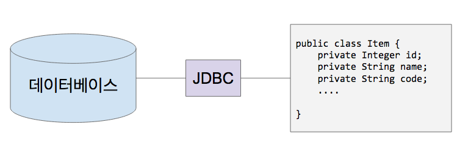

# JDBC

* JDBC(Java Database Connectivity)
	* Java에서 RDBMS와 자바의 연결고리 역할을 수행해주는 API.
	* 각각의 DBMS 벤더에서 제공해주는 JDBC Driver를 가지고 연동을 수행해야 함.
	* 관련 클래스
		* DriverManager: JDBC Driver 집합을 관리하는 클래스.
		* Connection: DB와 Java 애플리케이션과의 연결고리를 관리해주는 인터페이스. DriverManager의 getConnection 메서드를 이용하여 구현체에 해당하는 인스턴스를 가져올 수 있음.
		* DataSource: Connection Pool에 Connection 구현체 인스턴스를 저장 및 관리할 때 사용하는 인터페이스. Connection 구현체 인스턴스를 매번 가져오지 않고, 필요할 때 가져와서 사용 가능.
		* PreparedStatement: Connection 구현체 인스턴스를 가지고 SQL문을 수행할 때 사용하는 인터페이스. execute 메서드를 이용하여 SQL문 수행 가능.

<figure></figure>

 

* DBCP(DataBase Connection Pool)
	* JDBC를 이용한 DB 연동 시, 커넥션(Connection)을 여러 개 미리 만들어놓고 필요할 때마다 가져다 쓰는 것.
	* 처음에 몇 개를 만들어놓을지, 얼마나 응답이 없으면 에러를 던질지 등의 설정을 할 수 있음.
	* 애플리케이션 성능에 핵심적인 역할을 수행함.
	* Spring Boot 2.x+에서는 HikariCP를 기본 DBCP로 사용함.

 

* 참고
  * 인프런 <스프링 데이터 JPA> - 백기선
