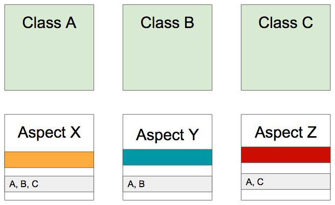

# Dependency Injection

### Spring AOP(Aspect Oriented Programming)
* 객체지향 프로그래밍(OOP, Object-Oriented Programming)을 보완할 수 있는 수단으로, 흩어진 관심사(Aspect)를 모듈화할 수 있는 프로그래밍 기법.
* 흩어진 관심사를 한 곳에 모아 공통된 요소로 정의함.
  * A에서 특정 요소 X를 쓰기위해, X를 A에 넣지 않고 X 자체를 A뿐만 아니라 어느 곳에 쓰는지 정의하여 여러 곳에서 활용 가능하도록 함.
* Aspect: 모듈을 묶어놓은 것.
* Target: 적용 대상.
* Advice: 수행해야하는 일.
* JointPoint: Advice가 적용되는 시점(끼어드는 시점).
* Pointcut: 구체적으로 Advice가 실행되는 시점.
* 사용을 위해 spring-boot-starter-aop 의존성을 추가해줘야 함.
```
dependencies {
    implementation 'org.springframework.boot:spring-boot-starter-aop'
}
```

<figure></figure>

<br>

### 의존성 주입(Dependency Injection)
* 어떤 객체에서 사용할 객체를 클래스에서 직접 만들어서 사용하는게 아니라 주입받아서 사용하는 것을 의미함.
* Setter 주입, Field 주입, 생성자 주입 등등의 여러 방법들을 통해 주입 가능함.
* Setter 주입
  * public으로 선언한 Setter를 통해 주입하는 방법.
  * 해당 인스턴스를 주입하지 않고 인스턴스 생성이 가능해지므로, Setter를 거치지 않고 그 인스턴스를 사용하는 메서드를 호출했을 때 NPE가 발생할 수 있음.
* Field 주입
  * @Autowired 애노테이션을 통해 주입하는 방법.
  * 코드가 간결해져서 과거에 자주 이용했었으나, final로 선언할 수 없기 때문에 주입 인스턴스가 변할 수 있음.
* 생성자 주입
  * 현재 가장 권장하는 주입 방법으로써, 생성자의 파라미터를 통해 주입하는 방법.
  * final로 선언 가능하며, 외부에서 주입 인스턴스 값을 바꿀 수 없게 함.
  * Lombok에 있는 @RequiredArgsConstructor 애노테이션을 이용하여 간편하게 주입할 수 있음.
    * 초기화되지 않은 final 필드 혹은 @NonNull이 붙은 필드에 대해 생성자를 생성해줌.
```
@Repository
public class PostRepository { 

}

// Setter 주입
@Service
public class PostService { 

    private PostRepository postRepository;

    public void setPostRepository(PostRepository postRepository) {
        this.postRepository = postRepository;
    }

}

// Field 주입
@Service
public class PostService { 

    @Autowired
    private PostRepository postRepository;

}

// 생성자 주입
@Service
@RequiredArgsConstructor
public class PostService { 

    private final BookRepository bookRepository;

}
```

<br>

### 제어의 반전(IoC, Inversion of Control)
* 프로그램 흐름을 개발자가 직접 제어하는게 아니라 외부에서 제어하는 디자인 패턴을 의미함.
* 의존성 주입의 상위 개념이라 볼 수 있음.

<br>

### Spring 빈(Bean)
* 스프링 IoC 컨테이너가 관리하는 인스턴스.
* @Repository, @Service 등의 애노테이션이 붙은 클래스를 이용하여 만들어짐.
* 애노테이션을 사용해서 객체를 빈으로 등록할 수 있음.
* 의존성 주입을 받으려면 빈이 되어야하며, IoC 컨테이너 안에 들어있는 객체들끼리만 의존성 주입을 해줌.
* 장점
  * 의존성 관리가 용이함.
  * 스코프
    * 싱글턴(Singleton): 하나의 인스턴스이며, IoC 컨테이너는 기본적으로 싱글턴 스코프로 등록됨. 이미 만들어진 인스턴스만 사용하므로, 성능적인 측면에서나 리소스 효율성 측면에서 유리함.
    * 프로토타입(Prototype): 매번 다른 인스턴스를 만들어 사용함.
  * 라이프사이클 인터페이스를 지원해줌.
    * 빈이 만들어졌을 때, 필요한 시점에 추가 작업을 할 수 있음.
    * 스프링 자체의 라이프사이클 콜백을 이용하여 부가적인 작업도 가능함.

<br>

### 싱글턴 패턴(Singleton Pattern)
* 애플리케이션 전반에 사용되는 해당 빈의 인스턴스가 오직 하나뿐인 것을 의미.
* 빈의 기본 스코프이며, 성능적인 측면에서나 리소스 효율성 측면에서 유리함.
* 실무에서는 대부분 싱글턴 스코프를 사용.

<br>

### BeanFactory
* Bean을 생성하고 Bean 간 의존관계를 설정하는 기능을 담당하는 기본적인 IoC 컨테이너 인터페이스.
* Spring Bean 컨테이너에 접근하기 위한 최상위 인터페이스로써, Bean 컨테이너의 기본 클라이언트 뷰라 볼 수 있음.

<br>

### ApplicationContext
* 애플리케이션 구성을 제공하는 중앙 인터페이스로써, IoC 컨테이너에 존재하는 중요한 인터페이스라 할 수 있음.
* BeanFactory를 상속받으면서 여러가지 추가 기능을 제공함.
  * 메시지 소스 처리 - MessageSource
  * 이벤트 발행 - ApplicationEventPublisher
  * 리소스 로딩 - ResourceLoader

<br>

#### 참고
* 인프런 <스프링 프레임워크 핵심 기술> - 백기선
