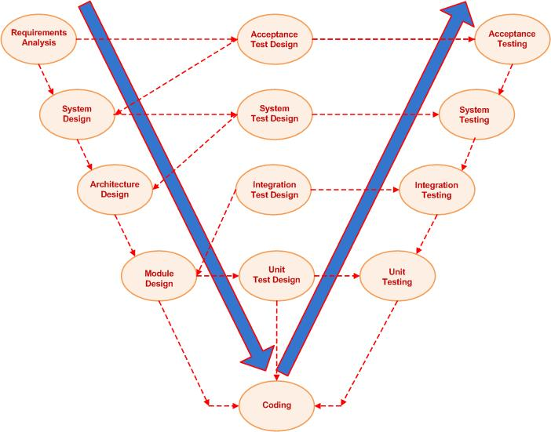

# Unit Test

### V 모델(V Model)
* 폭포수 모델의 확장된 형태로써, 설계 및 구현 단계에 테스트 단계를 V자 형태로 추가한 모델.
* 테스트가 강조됨으로써, 적정한 수준의 품질을 보증할 수 있도록 함.
* 테스트 작업들을 단계적으로 구분하므로, 각각의 책임이 명확해짐.
	1. 요구사항 분석 - 사용자 중심 -> 인수 테스트
	2. 시스템 설계 - 시스템 사양 결정 -> 시스템 테스트
	3. 아키텍처 설계 - 고수준 설계 -> 통합 테스트
	4. 모듈 설계 - 저수준 설계 -> 단위 테스트
	5. 구현 -> 코딩

<figure></figure>

 

### Test Matrix
* 여러 테스트 항목들을 항목별로 분류한 지표.

<figure></figure>

 

### 소프트웨어 품질
* 외적 품질(External Quality)
	* 소프트웨어가 올바르게 동작하는지 확인하는 기능적인 품질을 의미함.
* 내적 품질(Internal Quality)
	* 코드뿐만 아니라 그 코드를 검증하기 위한 테스트 코드 등의 철저한 구현이 동반된 구조적인 품질을 의미함.
* 내적 품질(ex. 테스트 코드 작성)을 높이면 좋은 이유
	* 내적 품질이 높아질수록 향후 코드 구현 및 유지보수를 수월하게 할 수 있기 때문.
		* 식당으로 비유하자면, 주방에서 쓰는 식기의 청결함이라 볼 수 있음.

 

### JUnit
* Java용 단위 테스트 도구.
* Java에서 여러 단위테스트를 수행할 때 필수적으로 사용함.
* spring-boot-starter-test 의존성을 추가하는 경우, 기본적으로 Junit5 의존성이 추가됨.
* JUnit5에서 사용하는 기본 테스트 애노테이션
	* @Test: 각각의 단위테스트 메서드 구현 시에 사용하는 애노테이션
	* @BeforeAll: 테스트 클래스에서 테스트를 하기 전에 한 번만 수행됨.
	* @BeforeEach: 테스트 메서드 수행 이전마다 한번씩 수행됨.
	* @AfterEach: 테스트 메서드 수행 이후마다 한번씩 수행됨. 
	* @AfterAll: 테스트 클래스에 있는 모든 메서드들의 테스트가 끝난 이후, 한 번만 수행됨.
	* @Disabled: 테스트 메서드를 무시할 때 사용함.
	* @DisplayName: 테스트 메서드에 대한 이름을 Text 형태로 지정할 때 사용함.

 

### Test Double
* 실제 객체로 테스트를 진행하기 어려울 때 이를 대신하여 사용할 수 있는 객체를 총칭함.
* 영화 촬영장에서 위험성 높은 액션 대역을 진행할 때 활용하는 스턴트 더블(Stunt Double)에서 유래됨.
* 테스트에서 수행하는 역할에 따라 여러 종류로 구분됨.
	* Dummy
		* 전달이 이루어지지만 실제로 사용하지 않는 객체.
		* 메서드 파라미터로 전달할 때 주로 사용하며, 정상적인 동작을 보장하지 않음.
	* Fake
		* 복잡한 로직을 가진 동작이나 외부 참조를 통해 이루어지는 동작을 단순화하여 구현한 객체.
		* 실제로 동작이 이루어지지만 상용 환경에 적용하기에는 적합하지 않음.
		* 대표적으로 H2와 같은 인메모리(In-Memory) DB가 있음.
	* Stub
		* Dummy 객체에 실제로 동작하는 것처럼 추가로 꾸며놓은 객체로써, 테스트 항목에 대한 구현이 최소한으로 되어 있음.
		* 테스트를 통해 호출된 요청에 대해 미리 구현해놓은 결과를 제공함.
		* 위와 같이 Stub 객체를 구현하는 작업을 스터빙(Stubbing)이라 함.
	* Spy
		* Stub 객체를 통해 호출된 내용에 대해 추가 정보를 기록하는 객체.
		* 실제 객체로도 사용 가능하며, 일부 테스트에 대해서는 Stub 객체로 만들어서 구현 가능.
		* Mockito의 verify 메서드를 통해 Spy 객체의 어떠한 메서드가 호출되었는지 확인 가능.
	* Mock
		* 테스트하려는 부분에 대한 리턴값을 미리 명세하고, 그에 따라 동작이 이루어지도록 프로그래밍된 모의 객체.

 

### 단위 테스트(Unit Test)
* 메서드 단위의 기능을 검증하여 그에 맞는 결과가 나오는지 확인하는 테스트.
* 하나의 기능이 올바르게 동작하는지 확인할 수 있음.
* 여러개의 단위 테스트를 통해 이슈가 있는 특정 부분을 빠르게 확인할 수 있음.
* 좋은 단위 테스트를 위한 규칙: FIRST
	* Fast: 빠르게 동작할 수 있어야 함. 구성 및 실행에 오랜 시간이 걸리는 테스트를 지양해야 함.
	* Independent: 각각의 테스트에 대해 인스턴스를 새롭게 생성해야 함. Junit 5의 경우, @BeforeEach 애노테이션을 이용하여 구성 가능.
	* Repeatable: 모든 테스트는 반복할 수 있어야 하며, 언제 어디서나 실행해도 문제없이 올바르게 작동해야 함. 그렇게 하기 위해 날짜나 파일 시스템에 대한 의존성(Dependency)을 제거해야 함.
	* Self-Validating: 테스트 과정 안에서만 올바르게 작동했는지 확인해야 하며, 외부 작업이 개입되지 않아야 함. 그리고, Pass/Fail 중 하나의 결과로만 명확하게 제공해야 함.
	* Timely: 실제 코드와 동시에 작성이 이루어져야 함.

 

### E2E 테스트(End-to-End Test)
* 종단(Endpoint)간 테스트로써, 애플리케이션을 이용하는 사용자 입장에서 처음부터 끝까지 하나의 흐름으로 테스트하는 것을 의미함.
* 단위 테스트를 통과한 모듈들이 상황에 맞춰 올바르게 동작하여 원하는 결과가 나오는지 확인함.

 

#### 참고
* https://ko.wikipedia.org/wiki/V_%EB%AA%A8%EB%8D%B8
* https://developertesting.rocks/
* https://www.samsungsds.com/kr/insights/test-driven-development.html
* https://www.code4it.dev/cleancodetips/f-i-r-s-t-unit-tests
* https://martinfowler.com/articles/mocksArentStubs.html
* https://tecoble.techcourse.co.kr/post/2020-09-19-what-is-test-double/

#### 배워가는 것들
* 거시적 관점에서의 개발 프로세스를 정리함.
* 개발 프로세스에서 진행되는 테스트 단계의 중요성을 알게 되었음.
* 테스트 코드 작성 시 반드시 알아야 할 필수 개념들을 정리함.
* Test Double에서 쓰이는 객체들이 어떠한 목적을 가지고 어떻게 쓰이는지 심도깊게 확인할 것.
