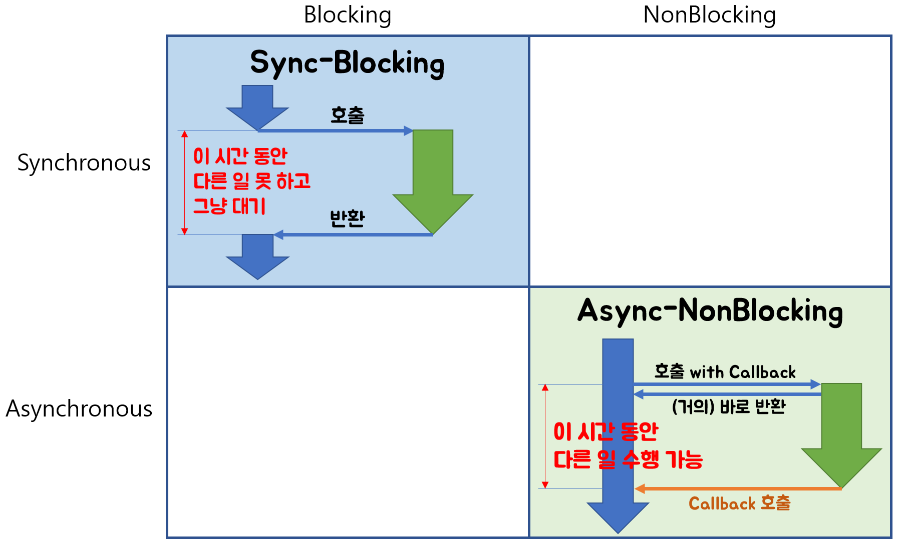

# HTTP Server

* Blocking vs Non-Blocking
  * Blocking
    * 다른 주체가 수행한 작업으로 인해 기존에 수행된 작업의 제어권이 넘어가는 현상.
    * 제어권이 넘어가는 동안에는 기존에 수행된 작업 주체에서 다른 작업을 수행할 수 없음.
  * Non-Blocking
    * 다른 주체에서 수행되는 작업에 관계없이 기존에 수행된 로직의 제어권이 유지되는 현상.
    * 제어권이 그대로 유지되므로, 기존에 수행된 작업 주체에서 다른 작업 수행 가능.
  * 비효율성을 막기 위해 Callback, Listener 등등을 이용한 비동기 프로그래밍과 이벤트 기반 프로그래밍이 필요함.

<figure><figcaption></figcaption></figure>

* 참고 링크
  * https://homoefficio.github.io/2017/02/19/Blocking-NonBlocking-Synchronous-Asynchronous/
