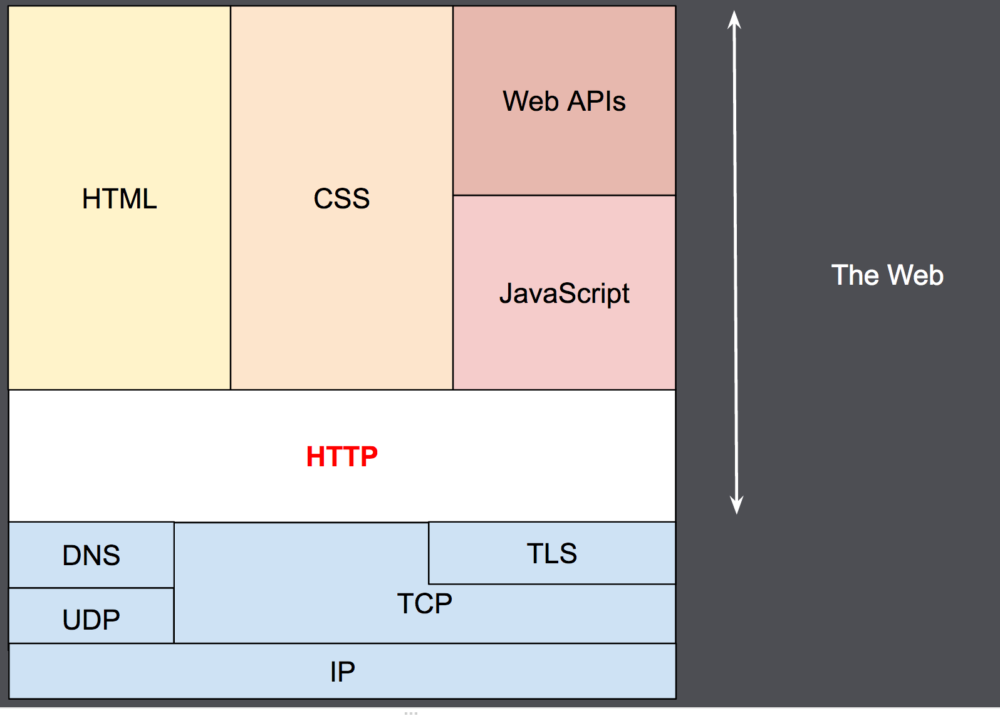
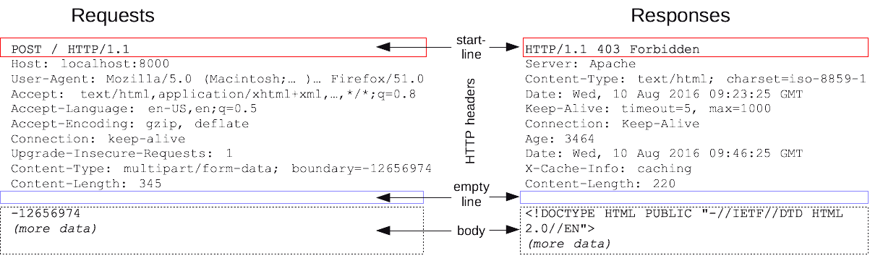

# HTTP의 이해

- HTTP 전반에 대한 개요를 정리한 문서이며, 세부 내용은 아래 문서로 분리하여 정리함
  - [HTTP 기본](/http/http-basic.md): HTTP의 4대 특징, 무상태와 비연결성, HTTP 메시지 구조
  - [HTTP 메서드](/http/http-method.md): 메서드별 특징과 속성, HTTP API 설계
  - [HTTP 상태코드](/http/http-status-code.md): 상태코드 분류와 리다이렉션
  - [HTTP 헤더](/http/http-header.md): 표현/협상/전송/인증 헤더, 쿠키
  - [HTTP 캐시와 조건부 요청](/http/http-cache.md): 캐시 동작, 검증 헤더, 캐시 무효화

 

### HTTP(HyperText Transfer Protocol)
- HTML과 같은 하이퍼미디어 문서를 가져오기 위해 사용하는 응용 계층 프로토콜. Web 상에서 이루어지는 데이터 통신의 기초 프로토콜이라 할 수 있음
- 거의 모든 형태의 데이터를 전송할 수 있으며, 서버 간 데이터를 주고받을때도 대부분 HTTP를 사용함
- 서버 리소스의 효율적인 사용을 위해 클라이언트-서버 간 통신 연결을 유지하지 않음(비연결성)
  - 다만 모든 요청별로 하나씩 응답하기에는 효율성이 떨어지므로, 이를 보완하기 위해 HTTP 지속 연결(Persistent Connections)을 이용함
- 현재 HTTP/1.1을 주로 사용하지만, HTTP/2와 HTTP/3의 사용도 점점 증가하고 있음
- HTTP 버전별 특징과 비연결성에 대한 상세한 내용은 [HTTP 기본](/http/http-basic.md) 참고

 

### OSI 7계층(OSI 7-Layer)
- 물리/데이터링크/네트워크/전송/세션/표현/응용 계층으로 구분함. 여기서는 데이터링크/네트워크/전송/응용 계층만 정리
- 데이터링크 계층: 소프트웨어 측면에서 하드웨어를 추상화하여 구분할 수 있는 계층. 이를 위해 하드웨어에서 제공하는 MAC Address로 구분함. 원격에서는 인지 불가
- 네트워크 계층: 인터넷을 이용하여 서로 떨어진 대상을 구분할 수 있는 계층. 이를 위해 IP Address를 할당하여 구분함
- 전송 계층: 하나 혹은 복수의 하드웨어에서 프로그램 간 데이터통신을 위한 계층. 이를 위해 TCP/UDP와 Port Number를 통해 구분함
- 응용 계층: 응용프로그램을 이용하여 통신을 위한 인터페이스를 제공하는 계층. 대표적으로 웹 브라우징을 할 때 쓰는 HTTP/HTTPS가 있음

 

### HTTPS
- 보안을 위해 TLS 프로토콜을 한번 거쳐서 HTTP 프로토콜을 이용하여 통신할 수 있도록 함
- 포트가 별도로 지정되지 않은 경우, 기본적으로 443/TCP를 사용함

 

<figure></figure>

 

### 클라이언트-서버 모델
- 클라이언트(Client): 임의의 프로세스를 요청하는 서비스 이용자
- 서버(Server): 요청한 프로세스를 처리하여 응답하는 서비스 제공자
  - 서버는 어떠한 서비스를 제공해야하는지 명확하게 정의해야 하며, 클라이언트는 서버가 제공한 서비스를 이용하기 위해 리소스를 명확하게 요청해야 함. URL(Uniform Resource Locator)을 가지고 클라이언트-서버 간 통신 수행

 

### 무상태(Stateless)/상태(Stateful) 프로토콜
- 무상태(Stateless) 프로토콜
  - 각각의 요청이 종속되지 않고 독립적으로 움직이는 프로토콜. 서버가 클라이언트의 상태를 보존하지 않음
  - 요청을 받는 서버의 수를 늘려주는 Scale-Out 수행에 유리함
- 상태(Stateful) 프로토콜
  - 각각의 요청이 종속되어 움직이는 프로토콜. 서버가 클라이언트의 상태를 보존함
- 무상태 설계의 장단점과 실무에서의 한계에 대한 상세한 내용은 [HTTP 기본](/http/http-basic.md) 참고

 

### 쿠키와 세션
- HTTP는 무상태 프로토콜이므로, 메시지를 주고받을 때 클라이언트 입장에서는 서버에게 항상 누구인지 인지시켜줘야 함
- 쿠키(Cookie): 상태정보에 대한 Key와 Value가 들어있는 파일. 클라이언트와 서버가 상태정보에 대한 요청과 응답을 지속적으로 주고받으며, 그 정보가 클라이언트에 저장됨
- 세션(Session): 쿠키를 기반으로 한 상태정보 파일. 쿠키와 다르게 상태정보가 서버에 저장됨. 일반적으로 세션에 대한 Key는 쿠키를 통해 관리함
- 쿠키의 생명주기, 도메인, 경로, 보안 속성에 대한 상세한 내용은 [HTTP 헤더](/http/http-header.md) 참고

 

### HTTP 메시지 구조

<figure></figure>

- 기본적으로는 사람이 인지할 수 있는 형태로 짜여있음
- 시작 줄(Start Line) - 헤더(Headers) - 빈 줄(Empty Line) - 본문(Body) 형태로 구성되며, HTTP 요청(Request)과 응답(Response) 모두 동일한 구조로 되어있음
- 각 구성 요소의 문법과 예시에 대한 상세한 내용은 [HTTP 기본](/http/http-basic.md) 참고

 

### HTTP 메서드(HTTP Method)
- GET: 서버에 있는 리소스를 클라이언트로 가져오기(Read) 위한 동작
- HEAD: GET 요청과 유사하지만, 응답 본문을 받아오지 않고 응답 헤더만 받아옴
- POST: 클라이언트가 서버에 특정 데이터를 추가(Create)하기 위한 동작
- PUT: 클라이언트가 서버에 기존 데이터를 수정(Update)하기 위한 동작이며, 리소스를 통째로 대체함
- PATCH: PUT 요청과 유사하지만, 기존 데이터를 유지한 채로 차이가 있는 부분만 전송함
- DELETE: 서버에 특정 데이터를 삭제(Delete)하기 위한 동작
- OPTIONS: 사용할 수 있는 HTTP Method를 확인할 때 사용하며, 서버 또는 특정 리소스가 제공하는 기능을 확인할 수 있음
- 메서드별 동작 예시와 안전/멱등/캐시가능 속성에 대한 상세한 내용은 [HTTP 메서드](/http/http-method.md) 참고

 

### HTTP 상태코드(HTTP status code)
- HTTP를 이용하여 통신을 진행할 때, 서버는 클라이언트 요청에 대한 응답을 전달해줘야 한다.
- HTTP 상태코드를 통해 응답에 대한 분류가 가능하다.
  - 1xx - 정보 응답(Informational): 직접 쓰는 일은 거의 없음
  - 2xx - 성공 응답(Successful): 요청을 정상적으로 처리함
  - 3xx - 리다이렉션(Redirection): 요청을 완료하려면 추가 행동이 필요함
  - 4xx - 클라이언트쪽 문제(Client Error): 잘못된 요청으로 인해 서버가 요청을 수행할 수 없음
  - 5xx - 서버쪽 문제(Server Error): 서버 문제로 정상적인 요청을 처리하지 못함
- 실무에서는 영구 리다이렉션의 경우 대부분 301을 사용하며 308은 거의 사용하지 않고, 임시 리다이렉션의 경우 대부분 302를 사용함
- 상태코드별 의미와 리다이렉션, PRG 패턴에 대한 상세한 내용은 [HTTP 상태코드](/http/http-status-code.md) 참고

 

### HTTP 캐싱(Caching)
- 서버로부터 가져온 리소스를 재활용하게 된다면, 그에 따른 Latency와 Network Traffic을 줄일 수 있게 되며, 브라우저에서의 로딩 속도를 향상시킬 수 있음
- HTTP에서는 위와 같은 캐싱 기능을 지원하며, Header에 Cache-Control을 선언하여 사용할 수 있음
- 상황에 맞춰 적절하게 적용해줘야 하며, Cache-Control 지시어와 검증 헤더(ETag, Last-Modified), 조건부 요청, 캐시 무효화에 대한 상세한 내용은 [HTTP 캐시와 조건부 요청](/http/http-cache.md) 참고

 

#### 참고
- https://developer.mozilla.org/ko/docs/Web/HTTP
- 인프런 <모든 개발자를 위한 HTTP 웹 기본 지식> - 김영한

 

#### 배워가는 것들
- HTTP에 대한 중요개념을 익힐 수 있었다. IT 실무자라 할 수 있는 서버 개발자, 클라이언트 개발자, DevOps 엔지니어, 네트워크 엔지니어 모두에게 중요한 개념이라 생각하기에, 잘 알고 있어야 한다는것을 느끼게 되었다.
- 로직 구현하다가 막히거나 모종의 이유로 장애가 발생했다면, 상당수의 경우가 데이터의 잘못된 전달로 인해 발생되는 문제라고 생각한다. 따라서, 이를 해결할 때 HTTP에 대한 개념들을 다시 한번 보면서 해결해야 할 필요성이 있을거라 생각한다.
