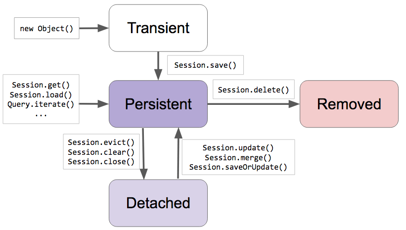

# ORM

### ORM(Object-Relational Mapping)
* 객체와 관계형 데이터베이스(RDBMS)를 매핑하는 기술.
* Java 애플리케이션의 클래스와 SQL DB 테이블 사이의 매핑 정보를 기술한 메타데이터를 사용하여,  
  Java 애플리케이션의 인스턴스를 SQL DB 테이블에 자동으로 영속화해주는 기술이라 할 수 있음.  
* 객체를 DB에 저장/수정/삭제할 때 SQL insert/update/delete문을 직접 작성하지 않고,  
  Java에서 인스턴스를 List, Map 등등에 저장하듯이 ORM 프레임워크에 저장하여 진행할 수 있음.
* RDBMS를 이용하더라도 객체 모델링에 집중할 수 있어서 효율적인 객체지향 개발이 가능해짐.
* 특정 벤더에 대한 의존성(Dependency)이 낮으므로, 무기력한 도메인 객체를 지양할 수 있으며, 객체지향 원칙을 최대한 유지하며 도메인 객체 영속화를 이룰 수 있음.
* 위와 같은 장점 때문에 학습곡선(Learning Curve)이 다소 높더라도 많은 개발자들이 애용하고 있음.

 

### ORM 패러다임 불일치
* 객체를 RDBMS에 매핑시키면서 발생하는 문제.
* 객체와 RDBMS는 지향하는 목적이 서로 다르므로, 기능과 표현방법에 있어 차이를 보임.
* DB에서 관리가 이루어지는 데이터 모델과 JPA를 통해 만들어지는 객체 모델간의 간극을 의미함.
* 객체 모델링을 정교하게 진행할수록 문제가 커질 수 있음.
* Java에서는 이러한 불일치를 해결하기 위해 JPA(Java Persistence API)가 등장함.
* 밀도(Granularity) 문제
  * 객체 모델 - 다양한 크기의 객체 생성 가능. 타입 커스터마이징 가능.
  * 데이터 모델 - 규격이 정해진 테이블 생성. 정해진 타입으로만 사용해야 함.
* 서브타입(Subtype) 문제
  * 객체 모델 - 다형성을 이용한 클래스 상속 구성 가능.
  * 데이터 모델 - 테이블 상속의 개념이 없으므로, 다형적 관계를 표현하지 못함.
* 식별성(Identification) 문제
  * 객체 모델 - 참조 동일성(==), 인스턴스 동일성(equals, hashcode 메서드)를 통하여 판별.
  * 데이터 모델 - 기본 키(PK, Primary Key)를 통하여 판별.
* 관계(Association) 문제
  * 객체 모델 - 객체 레퍼런스를 통해 관계 표현 가능. 다대다(M:N) 관계 구성 가능.
  * 데이터 모델 - 두 개의 테이블만으로 다대다(M:N) 관계 구성 불가능. 두 개의 테이블 PK를 외래 키(FK, Foreign Key)로 가지고 있는 매핑테이블을 이용하여 두 개의 1대다(1:N) 관계로 구성해야 함.
* 데이터 네비게이션(Navigation)의 문제
  * 객체 모델 - 레퍼런스를 이용하여 다른 객체로 이동 가능. 컬렉션 순회 가능.
  * 데이터 모델 - 참조를 통해 하나하나 요청하여 가져오는건 비효율적이므로, 이를 최소화하기 위해 조인(Join) 이용. 그렇지만 많이 가져올 경우 문제를 일으킬 수 있으며, N+1 Select 문제도 생각해봐야 함.

 

### JPA(Jakarta Persistence API)
* Jakarta EE에서 제공하는 관계형 데이터 관리 API로써, Java 진영의 ORM 기술 표준이라 볼 수 있음.
* JPA 그 자체는 인터페이스이기 때문에, 그 인터페이스를 구현한 구현체를 사용하게 됨. 대표적으로 Hibernate를 가장 많이 사용함.

 

### 엔티티(Entity)
* 데이터베이스 테이블에 매핑된 클래스를 의미함.
* 엔티티를 통해 만들어진 인스턴스는 테이블에서의 행과 매핑이 이루어짐.
* 데이터베이스 테이블과 엔티티를 매핑하는 작업은 JPA 프로그래밍에서 가장 기본적인 것이라 볼 수 있음.
  * 도메인 모델을 생성했다면, JPA 구현체에게 생성한 모델을 어떻게 매핑시킬지 알려줘야 함. 애노테이션을 통해 매핑 가능.
* 식별자(Identifier)를 대상으로 equals, hashcode 메서드를 가지고 동등성 비교를 수행할 수 있음. Lombok에 있는 @EqualsAndHashcode(of = (@Id가 선언된 변수))을 선언하여 사용 가능.

 

### 엔티티 생명주기
* Transient: 엔티티가 존재하는지 여부를 JPA가 모르는 상태.
* Persistent: 엔티티를 JPA가 관리중인 상태(1차 캐시, Dirty Checking, Write Behind 등등)
* Detached: JPA에 의해 관리되고있었던 엔티티를 더이상 관리하지 않는 상태.
* Removed: JPA가 관리하고 있었던 엔티티를 삭제하기로 한 상태.

<figure></figure>

 

#### 참고
* 인프런 <스프링 Data JPA> - 백기선
* <자바 ORM 표준 JPA 프로그래밍> - 김영한

#### 배워가는 것들
* ORM과 JPA에 대한 개념을 익힐 수 있었으며, JPA를 사용해야하는 이유에 대해 고찰해볼 수 있었다.
  * "무조건적으로 JPA를 사용해야 한다." 가 아니라, Spring Boot와 JPA를 이용하여 DB와의 연동 시 주는 이점을 잘 파악하여 사용해야 한다는 것을 알게 되었다.
* 엔티티에 대한 개념과 특징을 파악할 수 있었다. JPA 프로그래밍을 할 때, 엔티티를 통해 만들어진 인스턴스의 생명주기를 잘 파악하여 구현이 이루어져야한다는 것을 알게 되었다.
