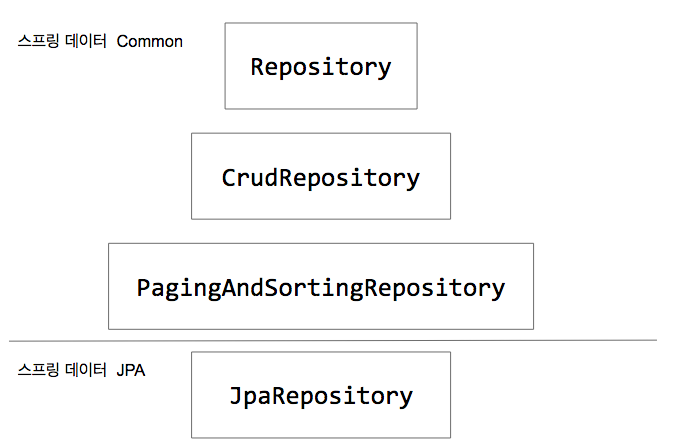

# Spring Data JPA

### 전통적인 방식으로 JPA를 이용한 프로그램을 개발할 때 비효율적인 점
1. 엔티티(Entity)가 추가될때마다 설정파일(resources/META-INF/persistence.xml)에 일일이 하나씩 추가해야 함.
2. 엔티티를 관리하는 주체인 EntityManagerFactory, EntityManager를 코드상에서 직접 관리해야 함.
3. JPA를 통해 데이터를 CRUD할 수 있는 작업 단위인 트랜잭션(Transaction)을 직접 관리해야 함.

<br>

### Spring Data JPA
*	JPA를 이용한 프로그램 개발 시, 여러 비효율성을 제거하여 비즈니스 로직에 집중할 수 있도록 도와주는 도구.
* spring-boot-starter-data-jpa 의존성과 연동시키려는 DBMS에 해당하는 JDBC Driver 의존성을 추가하여 사용.
* Repository 구현 시, JpaRepository를 상속받은 Interface로 개발할 수 있음.
	* JpaRepository<(해당 Entity), (@Id가 붙은 필드의 Data Type)> 형태로 상속.
	* JpaRepository를 상속받게 되면 @Repository 애노테이션을 붙일 필요가 없으며, 내부적으로 ImportBeanDefinitionRegistrar 인터페이스 구현체에 의해 Bean으로 등록됨.

```
build.gradle

dependencies {
    implementation 'org.springframework.boot:spring-boot-starter-data-jpa'
    implementation 'org.springframework.boot:spring-boot-starter-web'
    compileOnly 'org.projectlombok:lombok'
    developmentOnly 'org.springframework.boot:spring-boot-devtools'
    runtimeOnly 'org.postgresql:postgresql'
    annotationProcessor 'org.projectlombok:lombok'
    testImplementation 'org.springframework.boot:spring-boot-starter-test'
}


resources/application.yml

spring:
	datasource:
		url: jdbc:postgresql://localhost:5432/postgres
		username: postgres
		password: postgres


public interface PersonRepository extends JpaRepository<Person, String> {

}

```

<br>

### Spring Data JPA에서의 Repository 사용
* Repository: 마커. 특별한 기능은 없음.
* CrudRepository: 하나 또는 여러개의 엔티티 저장 및 엔티티의 데이터 조회 등 기본적인 CRUD 기능 제공.
* PagingAndSortingRepository: Page에 관한 기능 제공.
* JpaRepository: 스프링 데이터 JPA에 관한 기능 제공.
	* Spring Data JPA를 사용하여 Repository 클래스를 만들 때, 대부분 JpaRepository 인터페이스를 구현하여 사용함.

<figure></figure>

<br>

### DAO와 Repository 차이
* Repository: 엔티티를 관리하는 저장소와 관련 데이터를 처리하는 객체.
* DAO: 영속성을 가진 모듈인 DB에 접근하여 데이터를 처리하는 객체.
* DAO의 경우 DB에 데이터를 접근하는 것에 초점이 맞춰져 있으며, Repository의 경우 컬렉션을 통해 엔티티를 관리하는 것에 초점이 맞춰져 있음.
*	개념상 차이점은 존재하지만, 실제 프로그램상에서는 서로 비슷한 역할을 수행함.

<br>

### JPA Repository와 DDD의 Repository
* JPA Repository는 선언해놓은 엔티티를 Repository의 대상 엔티티로 삼게 됨.
* DDD(Domain-Driven Design)에서는 하나의 비즈니스 단위인 애그리거트(Aggregate)를 Repository의 대상 엔티티로 삼게 됨.

<br>

### @Transactional
* 하나의 작업 단위인 트랜잭션(Transaction)을 선언하기 위한 애노테이션.
* 클래스, 인터페이스, 메서드에 사용할 수 있으며, 메서드에 가장 가까운 애노테이션이 우선순위가 높음.
* Repository나 Service 계층에서 사용되며, 예외(Exception)가 발생되는 경우 해당 트랜잭션을 롤백시킴.
* Spring Data JPA가 제공하는 Repository의 모든 메서드에 기본적으로 적용되어 있음.
* 아래 옵션들을 지정할 수 있음.
	* readOnly: 읽기 전용 모드를 설정할 수 있음. 기본값은 false이며, 데이터 변경없이 Read만 수행한다면 성능 최적화를 위해 true로 설정해주는 것이 좋음.
	* isolation: 여러개의 트랜잭션들이 동시에 데이터베이스에 접근했을 때, 해당 트랜잭션들을 어떻게 처리할 것인지에 대한 설정(동시에 처리 / 하나하나 처리). 기본적으로 DB의 기본값을 따라가게 됨(대부분 READ_COMMITTED 방식이 기본값).
	* propagation: 트랜잭션을 어떻게 전파시킬 것인지에 관한 것. 예를 들어 @Transactional을 가지고 있는 메서드가 있고, 그 메서드 안에서 다른 메서드를 호출했는데 그 메서드도 @Transactional을 가지고있는 경우, 첫 번째 메서드가 가지고 있던 트랜잭션을 두 번째 메서드가 이어갈 것이냐, 두 번째 메서드 자체에서 트랜잭션을 만들어서 따로 사용할 것이냐를 결정하는 것(중첩된 트랜잭션 관한 내용).

<br>

#### 참고
* 인프런 <스프링 Data JPA> - 백기선
