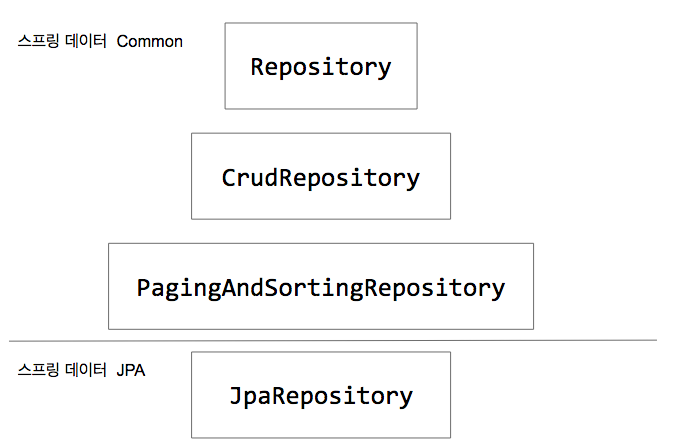

# Domain Model

* 도메인 모델(Domain Model)
  * 특정 비즈니스에 대한 모든 지식을 의미하는 도메인을 표현하는 개념적 모델.
  * 도메인끼리 행위(behavior)를 명확하게 구분하여 각자 맡은 역할에 맞춰 올바르게 위임해야 함.
  * Spring Data JPA에서는 Repository를 이용하여 도메인 모델을 관리하고 있음.

 

* Repository
  * 사전적 의미로는 여러 데이터들을 보관하기 위한 저장소를 의미함.
  * JPA를 이용하여 데이터베이스 접근을 수행하기 위한 인터페이스.

 

* Spring Data JPA에서의 Repository 사용
  * Repository: 마커. 특별한 기능은 없음.
  * CrudRepository: 하나 또는 여러개의 엔티티 저장 및 엔티티의 데이터 조회 등 기본적인 CRUD 기능을 제공.
  * PagingAndSortingRepository: Page에 관한 기능.
  * JpaRepository: 스프링 데이터 JPA에 관한 기능.
  * Spring Data JPA를 사용하여 Repository 클래스를 만들 때, 대부분 JpaRepository 인터페이스를 구현하여 사용함.

<figure></figure>

 

* VO(Value Object)
  * 하나의 도메인 모델에 값을 가지기 위한 목적으로 만들어진 객체.

 

* 참고
  * 인프런 <스프링 Data JPA> - 백기선