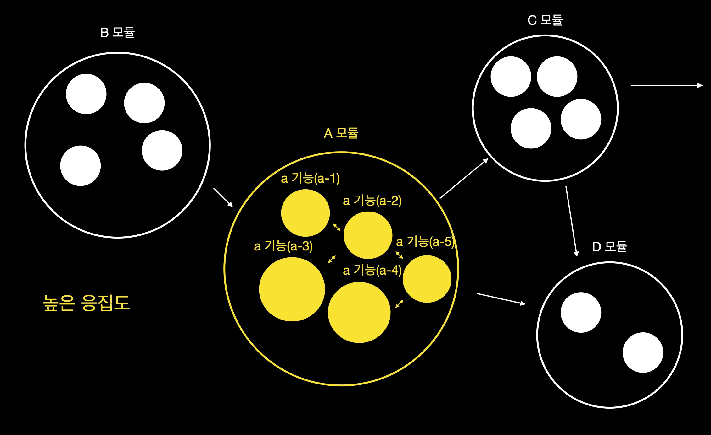
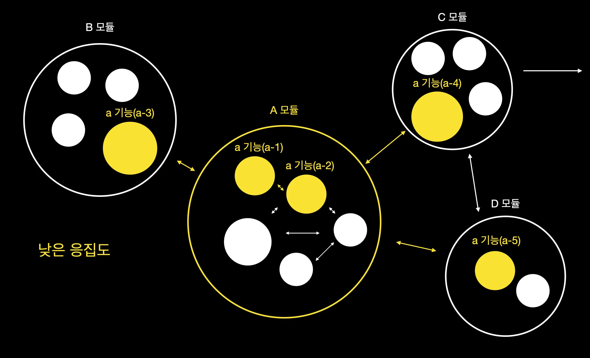
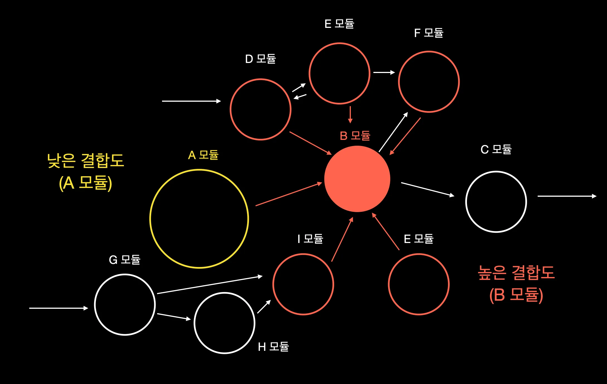

# Layered Architecture

* 관심사의 분리(Seperation of Concern)
  * 서로 같은 역할을 하는 부분(관심사)들끼리 분리시키는 것.
    * 각 부분에서 맡은 역할에만 집중하여 전체적인 프로세스에 대한 관리를 용이하게 해줌.
    * 파일 시스템의 디렉터리나 Java의 패키지를 이용하여 특정 관심사에 대한 로직 구분을 확실하게 할 수 있음.
  * SOLID 원칙 중 하나인 단일책임의 원칙에 부합하기 위함.

<br>

* 모듈(Module)과 모듈화
  * 하나의 거대한 프로그램 설계/구현 시, 기능별로 나누는 작업을 올바르게 진행해야 함.
  * 위 과정을 모듈화라고 하며, 그에 따른 개별적 요소를 모듈이라 함.
  * 모듈에 대한 독립성 척도를 결합도와 응집도를 통해 측정할 수 있음.
    * 결합도는 낮을수록 좋고, 응집도는 높을수록 좋음.
    * 보통 응집도가 높아지게 되면, 결합도는 대체적으로 낮아지게 됨.

<br>

* 응집도(Cohesion)
  * 임의의 모듈에 대해 관련된 기능이 많이 뭉쳐져있는지 판별하는 정도.
  * 응집된 정도에 따라 7개로 구분함(강함 - 약함 순).
    * 기능적 응집도: 모듈 내 모든 요소들이 하나의 기능을 수행하기 위해 구성된 경우.
    * 순차적 응집도: 모듈 내 하나의 요소로부터 나온 출력값을 다른 요소의 입력값으로 사용하는 경우.
    * 교환적 응집도: 모듈 내에서 동일한 입출력을 사용하여 서로 다른 기능을 수행하는 경우.
    * 절차적 응집도: 모듈 내 요소들이 서로 다른 기능을 하지만, 그 기능들을 순차적으로 수행하는 경우.
    * 일시적 응집도: 모듈 내 요소들이 순서에 상관없이 특정 시점에 반드시 수행하는 경우.
    * 논리적 응집도: 논리적으로 같은 모듈에 있지만, 요소 간 관계가 밀접하지 않은 경우.
    * 우연적 응집도: 모듈 내 요소들이 아무런 연관성없이 구성된 경우.

<figure></figure>
<figure></figure>

<br>

* 결합도(Coupling)
  * 서로 다른 모듈 간 상호 결합정도.
  * 결합된 정도에 따라 6개로 구분함(약함 - 강함 순).
    * 자료 결합도: 모듈 간에 전달되는 파라미터를 통해서만 데이터 교환이 일어나는 경우.
    * 스탬프 결합도: 모듈 간 인터페이스로 배열 또는 객체가 전달되는 경우.
    * 제어 결합도: 어떠한 모듈이 다른 모듈 쪽으로 처리 로직이 전달되는 경우.
    * 외부 결합도: 어떠한 모듈이 외부에 있는 다른 모듈에서 반환한 값을 참조하는 경우.
    * 공통 결합도: 모듈 밖에 있는 전역 데이터를 여러 모듈에서 참조하는 경우.
    * 내용 결합도: 어따한 모듈이 다른 모듈에 있는 내부 기능 혹은 데이터를 직접 참조하는 경우.

<figure></figure>

<br>

* 계층형 아키텍처(Layered Architecture)
  * 가장 일반적인 아키텍처 패턴으로써, N-tier 아키텍처 혹은 Multi-tier 아키텍처라고도 함.
  * 대부분의 Java 애플리케이션에서 사실상의 표준으로 사용하고 있음.
  * 수평적으로 구성되어있으며, 각각의 계층은 각자의 역할을 수행하게 됨.
  * 레이어 별로 관심사를 분리함으로써, 애플리케이션에 대한 개발/테스트 및 유지관리가 용이해짐.
  * 몇 개의 레이어가 존재해야하는지에 대한 명확한 기준은 없으나, 일반적으로 아래와 같이 네 개로 분류함.
    * 프레젠테이션 계층(Presentation Layer): 브라우저나 UI를 통한 사용자 요청을 받아서 비즈니스 계층으로 보내는 역할을 수행함. 웹 계층(Web Layer)이라고도 함.
    * 비즈니스 계층(Business Layer): 프레젠테이션 계층에서 온 비즈니스 로직을 처리하는 역할을 수행함. 영속성 계층에 있는 엔티티의 상태를 확인하거나 추가/변경/제거하기 위해 관련 컴포넌트를 호출함.
    * 영속성 계층(Persistence Layer): 엔티티를 가지고 데이터베이스(DB)에 접근하여 데이터를 저장/수정/삭제하는 역할을 수행함.
    * 데이터베이스 계층(Database Layer): 데이터가 저장되어있는 데이터베이스 그 자체를 의미함.

<figure></figure>

<br>

* 범용 고유 식별자(Universally Unique IDentifier, UUID)
  * 네트워크 상에서 고유한 데이터 및 리소스를 표기하기 위한 표준규약 식별자.
  * 아래와 같이 32개의 16진수와 4개의 하이픈(-)으로 구성됨.
    * <pre class="language-ini"><code class="lang-ini">11111111-aaaa-bbbb-cccc-222233334444</code></pre>
  * Java의 경우, java.util 패키지의 UUID 클래스에 있는 randomUUID() 메서드를 이용하여 생성 가능.

<br>

* ULID(Universally Unique Lexicographically Sortable IDentifier)
  * 무작위로 생성되는 UUID의 단점을 보완하여 나온 식별자.
  * 48bits의 Timestamp와 80bits의 무작위 생성 문자로 구성됨.
  * 앞쪽에 Timestamp가 들어가기 때문에 순서가 보장되며, 특수문자가 없음.
  * ulid-creator 의존성을 추가해줘야 함.
```  
 01AN4Z07BY      79KA1307SR9X4MV3

|----------|    |----------------|
 Timestamp          Randomness
   48bits             80bits
```
```
  implementation 'com.github.f4b6a3:ulid-creator:5.1.0'
```

<br>

* TSID(Time-Sorted Unique IDentifier)
  * ULID를 개선하여 나온 식별자. 시간 순으로 정렬 가능함.
  * tsid-creator 의존성을 추가해줘야 함.
```
implementation 'com.github.f4b6a3:tsid-creator:5.2.0'
```

<br>

* 참고
  * https://medium.com/@jang.wangsu/설계-용어-응집도와-결합도-b5e2b7b210ff
  * https://www.oreilly.com/library/view/software-architecture-patterns/9781491971437/ch01.html
  * https://github.com/ulid/spec
  * https://github.com/f4b6a3/tsid-creator
