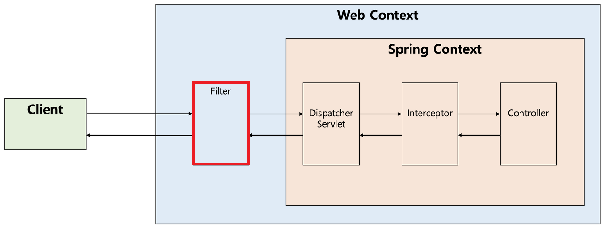

# 애플리케이션 수준의 보안

### 인증과 인가
* 인증(Authentication)
  * 사용자의 신원(Identity)을 확인하는 절차로써, 인증을 수행하기 위한 요소를 가지고 진행함.
  * 실생활에서의 사례
    * 은행에 방문하여 계좌에 있는 거액의 돈을 인출하려 할 때, 은행원은 요청자에게 신분증을 요구할 수 있음. -> 인증수행요소: 신분증
    * 무인발급기를 통해 개인정보가 들어있는 문서를 출력할 때, 지문 스캔 과정을 거침. -> 인증수행요소: 지문
  * 컴퓨터 보안에서의 인증
    * 임의의 시스템에 대한 접근권한을 확인하기 위한 절차.
    * ID/Password를 통한 인증을 가장 많이 수행하며, 상황에 따라 SMS를 통한 2단계 인증(Two-Factor Authentication)도 추가로 수행할 수 있음.
    * 최근에는 SMS 인증뿐만 아니라, 인증 전문 소프트웨어(ex. Google OTP, PASS 등등)와 연동하여 인증 절차를 수행하고 있음.
    * 인증을 거치게 되면 시스템과 통신을 하기 위한 경로(세션)가 만들어지게 되며, 정해진 시간동안 인증절차 없이 접근할 수 있음.
* 인가(Authorization)
  * 임의의 시스템에 대한 특정 기능 접근권한을 얻는 작업을 의미함.
  * 실무에서는 주로 관련 세부사항이 담긴 Access Token을 이용함.
    * 사용자가 로그인을 수행하게 되면, 그 사용자 정보에 따른 Access Token이 만들어짐. 이것을 가지고 특정 기능에 대한 접근 허용여부를 결정짓게 됨.
  * 인가를 위해 만들어진 Access Token은 단순히 특정 기능 접근 허용여부에 필요한 데이터이며, 이를 가지고 사용자의 신원을 온전하게 파악할수는 없음.
  * 사례
    * 쇼핑몰에 특정 상품정보를 올리거나 수정하려 할 때, 해당 쇼핑몰 관리자만 올릴 수 있어야 한다. 즉, 관리자 페이지에 대한 접근권한을 부여해야한다.
    * OTT 서비스를 이용할 때, 해당 구독모델에 따라 영상콘텐츠 해상도 설정 접근권한이 달라져야 한다.

<br>

### HTTP Stateless
* HTTP는 클라이언트-서버 간 통신에서 클라이언트의 요청 상태를 보존하지 않음.
* 따라서, Cookie나 Session, LocalStorage 등등을 이용하여 클라이언트 상태를 유지시켜줘야 함.

<br>

### Cookie vs WebStorage
* Cookie
  * Key와 Value 형태의 상태정보 파일. 클라이언트와 서버가 상태정보에 대한 요청과 응답을 지속적으로 주고받으며, 그 정보가 클라이언트에 저장됨.
  * Session Cookie: 메모리에 임시로 저장되는 쿠키로써, 만료시간이 설정되어있음. Non-Persistent Cookie, Temporary Cookie라고도 하며, 브라우저가 종료되면 삭제됨.
  * Persistent Cookie: 유효기간 설정을 통해 장시간 유지될 수 있는 쿠키. 디스크에 저장되기 때문에 브라우저를 종료하거나 브라우저를 띄운 장비를 재시작해도 남아있음. 유효기간 만료 시 파기됨.
* WebStorage
  * Key와 Value 형태로 저장하는 새로운 형태의 상태정보 파일로써, HTML5 명세(Spec)에 포함되어 있음.
  * 기존 쿠키(Cookie)와 유사하지만, 몇가지 차이점이 존재함.
    * HTTP를 통한 통신을 수행할 때 쿠키와 다르게 데이터를 서버로 전송하지 않기 때문에, 네트워크 트래픽에 대한 부담을 줄일 수 있음.
    * 객체 형태로 저장 가능.
  * 지속성과 용량제한에 따라 아래 두 가지로 구분함.
    * LocalStorage: 직접 데이터를 지우지 않는 이상 영구적으로 보존 가능하며, 용량제한이 없음.
    * SessionStorage: 브라우저를 닫을 때까지 저장되며, 5MB의 용량제한을 가짐.

<br>

### Interceptor vs Filter in Spring

<figure></figure>

* Filter
  * J2EE 표준스펙에 있는 기능으로써, 들어온 요청과 처리가 이루어진 응답을 걸러내는 역할을 수행함.
  * Spring MVC의 핵심이라 할 수 있는 DispatcherServlet으로 요청을 전달하기 전에 부가적인 작업을 처리할 수 있는 기능 제공.
  * Spring과 무관하게 웹 컨텍스트(Web Context)에서 동작함.
  * javax.servlet.Filter 인터페이스를 구현해야 하며, 아래와 같이 세가지 메서드를 가지고 있음.
    * init(filterConfig): Filter 인스턴스를 초기화하고 서비스에 추가할 때 사용함.
    * doFilter(request, response, chain): HTTP 요청이 DispatcherServlet에 전달되기 전, 웹 컨테이너에 의해 실행됨. 여기서 FilterChain을 이용하여 다음 대상으로 요청을 전달함.
    * destroy(): Filter 인스턴스를 제거하고 해당하는 리소스를 반환할 때 사용함.
```
public interface Filter {

    public default void init(FilterConfig filterConfig) throws ServletException {}
    
    public void doFilter(ServletRequest request, ServletResponse response,
            FilterChain chain) throws IOException, ServletException;
            
    public default void destroy() {

    }

}
```
* Interceptor
  * Spring에서 제공하는 기술로써, DispatcherServlet에서 컨트롤러(Controller)를 호출하기 전후에 요청을 가로채서 응답을 가공할 수 있는 기능 제공.
  * Filter와 다르게 Spring Context 내부에서 동작함.
  * 핸들러 매핑에 설정할 수 있는 인터셉터인 HandlerInterceptor 인터페이스를 구현해야 하며, 아래와 같이 세가지 메서드를 가지고 있음.
    * preHandle(request, response, handler)
      * 핸들러 실행 전에 호출되며, 핸들러에 대한 정보를 사용할 수 있기 때문에 Filter에 비해 보다 세밀한 로직 구현 가능함.
      * 요청 데이터 전처리가 필요할 때 주로 사용.
    * postHandle(request, response, modelAndView)
      * 핸들러 실행이 끝나고 DispatcherServlet이 뷰를 렌더링하기 전에 호출됨. View에 전달할 추가 모델 객체를 노출시킬 수 있음.
      * 후처리 작업이 필요할 때 주로 사용.
      * 인터셉터 역순으로 호출되며, 비동기적인 요청 처리 시에는 호출되지 않음.
    * afterCompletion(request, response, handler, ex)
      * 요청 처리가 완전히 끝난 후(뷰 렌더링 끝난 후)에 호출됨. preHandle 메서드에서 true를 리턴한 경우에만 호출됨.
      * postHandle 메서드와 마찬가지로 체인의 각 인터셉터에서 역순으로 호출되므로 첫 번째 인터셉터가 가장 마지막에 호출됨.
```
public interface HandlerInterceptor {

    default boolean preHandle(HttpServletRequest request, HttpServletResponse response, Object handler) throws Exception {
        return true;
    }
    
    default void postHandle(HttpServletRequest request, HttpServletResponse response, Object handler, @Nullable ModelAndView modelAndView) throws Exception {

    }
        
    default void afterCompletion(HttpServletRequest request, HttpServletResponse response, Object handler, @Nullable Exception ex) throws Exception {

    }
        
}
```

<br>

### 암호화와 복호화
* 암호화(Encryption): 평문(원래 문장)을 알아보기 어렵게 변환하여 암호문으로 만드는 작업.
  * 혼돈(Confusion): 암호문에서 키를 알아내기 어렵게 하는 성질. 원래 대상과 다른 대상을 섞어서 원래 대상의 정체를 알아볼 수 없게 함.
  * 확산(Diffusion): 암호문에서 평문을 알아내기 어렵게 하는 성질. 원래 대상이 암호문 내에서 최대한 퍼지도록 함.
  * 암호화의 안전성은 혼돈과 확산을 올바르게 달성했는지에 대한 여부로 판단할 수 있음.
* 복호화(Decryption): 암호문을 평문으로 변환시키는 작업.
* 단방향 암호화(One-Way Encryption)
  * 평문으로 되돌릴 수 없는 암호화 과정을 의미함(비가역성).
  * 복호화할 수 없는 비밀번호를 서버 내부 모듈에 저장함으로써, 유출되었을 때 확인이 불가능하도록 함.
  * 로그인 수행 시, 서버에서는 입력된 비밀번호를 지정된 암호화 알고리즘을 통해 암호문으로 바꾼 후 저장된 암호문과 비교하여 인증을 수행한다. 
* 해싱 알고리즘(Hashing Algorithm): 임의의 데이터를 정해진 길이의 데이터로 쪼개어 매핑하는 단방향 함수를 의미함.
* 암호학적 해시 함수: 해싱 알고리즘의 일종으로써, 입력값이 조금만 바뀌어도 그에 해당하는 출력값이 크게 변하는 특성이 있음. 주요 목적은 아래와 같음.
  1. 역상 저항성(Preimage Resistance): 출력값에 대해 그 값을 생성하는 입력값을 찾기 어려워야 함.
  2. 제2 역상 저항성(Second Preimage Resistance): 특정 입력값과 동일한 출력값으로 변환되는 다른 입력값을 찾을 수 없어야 함.
  3. 충돌 저항성(Collision Resistance): 동일한 출력값으로 변환되는 두 개의 입력값을 찾을 수 없어야 함. 제2 역상 저항성과 유사하나, 암호학적으로 주어진 조건에 대한 차이가 미묘하게 존재함.
* Salt가 필요한 이유
  * 특정 평문에 대한 암호문 유추를 하지 못하도록 평문에 임의의 데이터를 추가하는 작업이 필요함.
  * 음식에 소금을 살짝 가미함으로써 그 감칠맛을 살리듯이, 출력값 유추를 불가능하게 하기 위한 목적을 달성할 수 있어야 함.
* 완벽에 가까운 IT 시스템 보안을 추구하기 위해서는 단순히 시스템에서 오가는 데이터의 암호화만 생각할게 아니라, 암호문을 평문으로 풀어내는 키의 관리도 잘 이루어져야 함.

<br>

#### 참고
* https://developer.mozilla.org/en-US/docs/Web/API/Web_Storage_API
* https://auth0.com/intro-to-iam/authentication-vs-authorization
* https://erwinousy.medium.com/쿠키-vs-로컬스토리지-차이점은-무엇일까-28b8db2ca7b2
* https://velog.io/@ejchaid/localstorage-sessionstorage-cookie의-차이점
* https://dev-coco.tistory.com/173
* 인프런 <스프링 시큐리티> - 백기선
* <인크립션> - 김덕수, 이석우

#### 배워가는 것들
* 정보보안의 핵심개념이라 할 수 있는 인증/인가에 대해 학습했다.
* 인증/인가 관련 기능 구현(ex. 로그인, 로그아웃, 로그인 시 Remember-Me 기능 구현) 시, HTTP의 Stateless한 특성을 잘 파악해야 할 것이다.
* Cookie와 WebStorage에 대해 학습했다.
  * 사실 WebStorage에 대해서는 생소한 부분들이 적지않게 있었다. HTTP를 통한 통신을 수행할 때 WebStorage 사용 비중이 높아지고 있으므로, 잘 숙지해놔야 할 것이다.
* Filter와 Interceptor의 특징과 차이점에 대해 익힐 수 있었다.
* HandlerInterceptor 인터페이스를 구현한 클래스를 이용하여 어떻게 인증/인가 관련 기능을 구현할 수 있는지 확인해볼 수 있었다.
* 암호화와 복호화에 대해 익힐 수 있었다.
  * 왜 단방향 암호화를 사용해야 하는지, Salt를 왜 사용해야 하는지를 알아볼 수 있었다.
