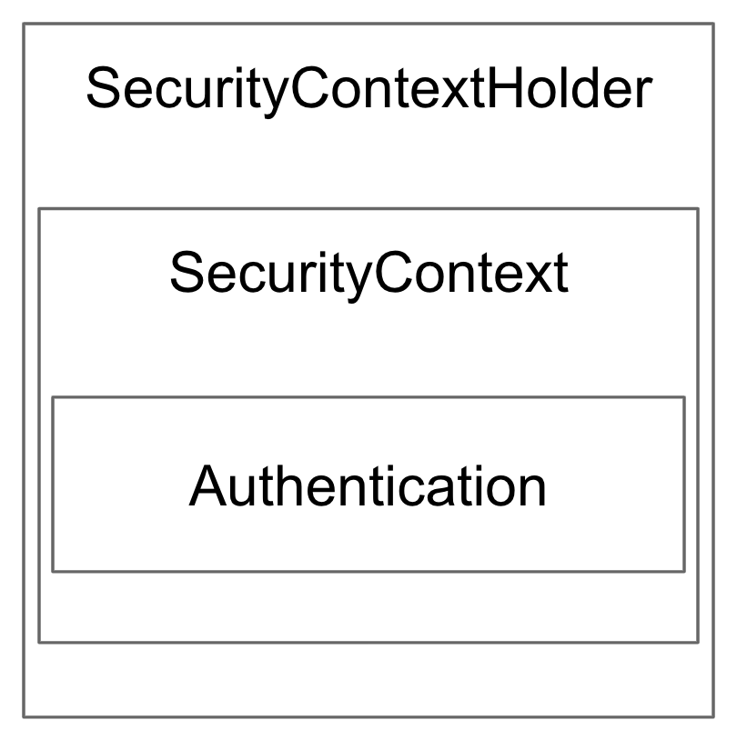

# 인증(Authentication)

### 식별자(Identifier)
* 특정 대상을 명확하게 식별할 수 있는 이름을 의미함.
* 우리나라에서는 앞 두글자를 본떠서 ID로 쓰이지만, 고유 식별자를 쓸 때는 UUID 혹은 하나씩 값이 증가(auto-increment)하는 자연수 값을 사용하는 경우도 있음.
* 따라서, 임의의 사용자에 대한 식별자를 표현할 때는 문자 그대로 "사용자 이름"이라는 의미를 가진 Username이 더 옳은 표현이라 할 수 있음.

<br>

### OAuth 2.0
* 회원가입 프로세스를 통해 만들어진 계정이 아닌 임의의 포털(ex. Google, Facebook, NAVER, Kakao 등등) 계정 정보를 가지고 로그인을 수행하기 위한 업계 표준 프로토콜을 의미함.
* 포털을 통해 로그인을 수행하면, 넘겨준 토큰(Token)을 가지고 포털로부터 사용자 정보 조회가 가능해짐.

<br>

### Bearer Token
* Bearer 인증이 부여된 토큰을 의미하며, 토큰을 전달하는 사용자에게 접근권한을 부여하기 위한 목적으로 사용됨.
* 대표적으로 JWT(JSON Web Token)가 있음.

<br>

### SecurityFilterChain
* 요청에 대한 접근권한 제어를 위해 Spring Security에서 제공해주는 인터페이스.
* Spring Security 5.7 이후부터 WebSecurityConfigurerAdapter가 Deprecation되면서 이를 상속받아 구성하지 않고, SecurityFilterChain을 Bean으로 등록하여 구성해야 함.
* 설정을 구성하기 위한 @Configuration 애노테이션과 Web 보안 활성화를 위한 @EnableWebSecurity 애노테이션을 추가하여 아래와 같이 구성할 수 있음.
  * 특정 API에 대한 권한 설정 가능.
  * 로그인/로그아웃 API 구성 가능.
  * rememberMe 토큰 구성 가능.
```
@Configuration
@EnableWebSecurity
@RequiredArgsConstructor
public class SecurityConfig {

    @Bean
    public SecurityFilterChain filterChain(HttpSecurity http) throws Exception {
        http.authorizeRequests()
            .mvcMatchers("/login").not().fullyAuthenticated()
            .mvcMatchers("/", "/sign-up", "/check-email-token",
                "/email-login", "/login-by-email", "/search/study").permitAll()
            .mvcMatchers(HttpMethod.GET, "/profile/*").permitAll()
            .anyRequest().authenticated();

        http.formLogin()
            .loginPage("/login");

        http.logout()
            .logoutSuccessUrl("/");

        http.rememberMe()
            .userDetailsService(accountService)
            .tokenRepository(tokenRepository());

        return http.build();
    }
}
```

<br>

### OncePerRequestFilter
* 기존 Filter에서 세 개의 메서드를 오버라이딩하는 번거로움을 피하기위해 Spring Web에서 제공하는 추상 클래스.
* doFilterInternal(request, response, filterChain) 메서드 하나만 구현하면 됨.
* 구현한 Filter가 기본 인증필터보다 먼저 실행되도록 SecurityFilterChain에 추가해야 함.

```
@Component
@RequiredArgsConstructor
public class AccessTokenAuthenticationFilter extends OncePerRequestFilter {

    private static final String AUTHORIZATION_FINAL = "Bearer ";

    private final AccessTokenService accessTokenService;

    @Override
    protected void doFilterInternal(HttpServletRequest request, HttpServletResponse response,
                                    FilterChain filterChain) throws ServletException, IOException {
        String accessToken = parseAccessToken(request);
        Authentication authentication = accessTokenService.authenticate(accessToken);

        SecurityContextHolder.getContext().setAuthentication(authentication);

        filterChain.doFilter(request, response);
    }

    private String parseAccessToken(HttpServletRequest request) {
        return Optional.ofNullable(request.getHeader("Authorization"))
                .filter(i -> i.startsWith(AUTHORIZATION_FINAL))
                .map(i -> i.substring(AUTHORIZATION_FINAL.length()))
                .orElse("");
    }
}


@Configuration
@EnableWebSecurity
@RequiredArgsConstructor
public class WebSecurityConfig {

    private final AccessTokenAuthenticationFilter authenticationFilter;

    @Bean
    public SecurityFilterChain securityFilterChain(HttpSecurity http) throws Exception {
        http.addFilterBefore(authenticationFilter, BasicAuthenticationFilter.class);
        http.authorizeHttpRequests().anyRequest().authenticated();

        return http.build();
    }

}
```

<br>

### FilterChain
* 서블릿 컨테이너에서 제공해주는 인터페이스로써, 클라이언트에서 서블릿 컨테이너로 들어오는 요청을 필터링하는 역할을 수행하는 필터들을 이어줌.
* 각각의 필터들은 다음 필터를 호출하기 위해 FilterChain을 이용하며, 만약 FilterChain에 묶인 마지막 필터라면 그에 묶인 리소스를 반환함.

<br>

### SecurityContextHolder, SecurityContext, Authentication
* SecurityContextHolder
  * SecurityContext 인스턴스가 저장되어있는 Wrapper 클래스. 기본적으로 ThreadLocal을 사용하며, 아래 세가지의 저장방식을 지원함.
    * MODE_THREADLOCAL: 기본 저장방식이며, 쓰레드당 SecurityContext 객체를 할당함. 자식 쓰레드와는 공유가 되지 않음.
    * MODE_INHERITABLETHREADLOCAL: 메인 쓰레드와 자식 쓰레드에 관하여 동일한 SecurityContext를 유지함.
    * MODE_GLOBAL: 하나의 애플리케이션에서 오직 하나의 SecurityContext를 저장함.
* SecurityContext
  * Authentication 인스턴스가 저장되어있는 보관소로써, 구현 시 언제든지 Authentication 인스턴스를 꺼내서 제공해줘야 함.
* Authentication
  * 사용자를 지정하는 Principal과 권한을 지정하는 GrantAuthority를 제공하는 인터페이스.
  * SecurityContext 인터페이스에서 제공하는 setAuthentication(authentication) 메서드를 통해 SecurityContext에 인증 설정 가능하며, getAuthentication 메서드를 통해 Authentication 구현체 인스턴스를 가져올 수 있음.

<figure></figure>

<br>

#### 참고
* https://inpa.tistory.com/entry/WEB-%F0%9F%93%9A-OAuth-20-%EA%B0%9C%EB%85%90-%F0%9F%92%AF-%EC%A0%95%EB%A6%AC
* https://spring.io/blog/2022/02/21/spring-security-without-the-websecurityconfigureradapter
* 인프런 <스프링 시큐리티> - 백기선

#### 배워가는 것들
* 인증 과정에서 사용하는 식별자에 대해 익힐 수 있었다. Username이라는 키워드를 사용하는 이유에 대해서도 파악해볼 수 있었다.
* OAuth 2.0과 Bearer Token에 대해 학습할 수 있었다. 이러한 기술들이 어떻게 사용되는지, 어떻게 구현할 수 있는지에 대해 익힐 수 있었다.
* @Configuration, @EnableWebSecurity 애노테이션을 이용한 SecurityFilterChain 구현체 구성방법을 익힐 수 있었다.
* OncePerRequestFilter에서 제공해주는 doFilterInternal 메서드 활용 방법을 익힐 수 있었다.
