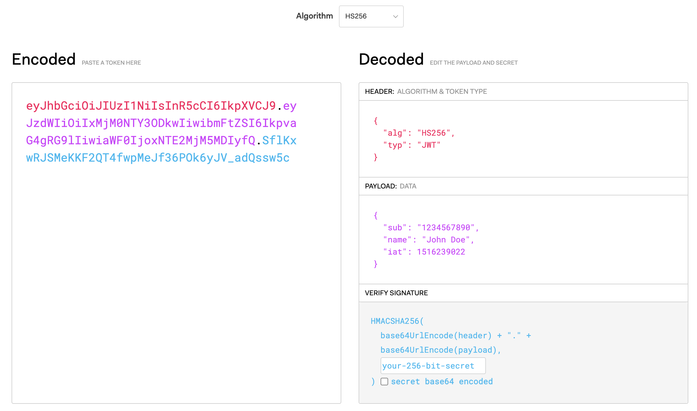

# JWT & Authority

### JWT(Json Web Token)
* JSON 형태로 사용자를 인증하기 위해 디지털 서명을 활용하는 인터넷 표준. 아래와 같이 세 부분으로 구성됨.
  * 헤더(Header): 토큰 종류와 해시 알고리즘 정보가 들어있음.
  * 페이로드(Payload): 토큰의 정보가 인코딩된 부분으로써, 하나의 부분을 클레임(Claim)이라 칭함.
  * 시그니처(Signature): 토큰을 확인하게 하기 위한 일련의 문자열로, 각각의 요청 시 토큰이 변조되었는지 여부를 확인할 수 있음. 만약 변조가 확인된 경우, 인증이 무효화됨.

<figure></figure>

<br>

### 클레임 기반 ID(Claims-based identity)
* 인증 주체가 무엇인지를 의미하는 Key-Value 방식의 데이터인 클레임(Claim)을 가지고 인증하기 위한 수단을 의미함.

<br>

### 대칭키 암호화 / 공개키 암호화
* 대칭키 암호화
  * 암호화/복호화 시에 사용하는 키가 서로 같은 암호화 알고리즘으로써, 비밀키 암호화라고도 함.
  * 암호화된 정보를 전달하는 송신자와 그 정보를 받아 복호화하는 수신자가 서로 같은 키를 가지고 있어야 함.
  * 암호화/복호화 속도가 빠르지만, 키 전달 시 탈취의 위험성이 존재함.
  * 대표적으로 DES, AES, SEED 등등이 있음.
  * 안전하게 키를 관리할 수 있다는 전제하에 대용량 데이터 암호화/복호화 시에 주로 사용.
* 공개키 암호화
  * 암호화/복호화 시에 사용하는 키가 서로 다른 암호화 알고리즘으로써, 비대칭키 암호화라고도 함.
  * 암호화된 정보를 전달하는 송신자는 자신의 비밀 키(Private Key) 공개 키(Public Key)를 모두 가지고 있는 상황에서 비밀 키를 가지고 암호화가 이루어지며, 그 정보를 받아 복호화하는 수신자는 송신자의 공개 키만 가지고 복호화를 수행함.
  * 암호화/복호화 속도가 대칭키 암호화에 비해 상대적으로 느리지만, 보안상 안전성이 좀더 높음.
  * 대표적으로 RSA, Diffie-Hellman, ECDSA 등등이 있음.
  * SSH 접속 혹은 Rsync를 이용한 데이터 동기화 시, 비밀번호 없이 인증을 수행할 때 주로 사용함.

<br>

### `@EnableMethodSecurity, @Secured`
* 사용자의 역할에 따른 접근권한을 설정할 때 사용하는 애노테이션.
* 클래스 혹은 메서드 단위의 인가 처리가 가능해짐.
* @EnableMethodSecurity의 경우, Spring Security 5.6 이후부터 사용 가능하며, @EnableGlobalMethodSecurity의 상위호환이라 할 수 있음.
* @Configuration 애노테이션이 선언된 클래스에 아래와 같이 @EnableMethodSecurity를 선언한 후, Controller 단에서 @Secured 애노테이션을 이용하여 인가 처리를 수행할 수 있음.
```
@Configuration
@EnableWebSecurity
@EnableMethodSecurity(securedEnabled = true)
public class WebSecurityConfig {
    (중략)
}

@GetMapping("/admin")
@Secured("ROLE_ADMIN")
public String admin() {
    return "Hello, world!";
}

@GetMapping("/user")
@Secured({"ROLE_USER", "ROLE_ADMIN"})
public String user() {
    return "Hello, world!";
}

```

<br>

#### 참고
* https://jwt.io/
* https://docs.spring.io/spring-security/reference/servlet/authorization/method-security.html
* https://docs.spring.io/spring-security/reference/servlet/authorization/architecture.html
* 인프런 <스프링 시큐리티> - 백기선

#### 배워가는 것들
* JWT에 대한 개괄적인 개념 파악.
* @EnableMethodSecurity, @Secured를 사용하여 특정 권한에 따른 인가처리.
* @EnableGlobalMethodSecurity와 RoleHierarchyImpl, SecurityExpressionHandler를 이용하여 관리자/사용자 간 역할(Role) 계층 구현도 가능하지만, @EnableMethodSecurity를 사용할 경우 RoleHierarchy 포팅이 안되는 것으로 알고 있음. AccessDecisionVoter를 사용해보았으나 아직 명확한 방법을 찾지 못함. 추후 확인 필요.
